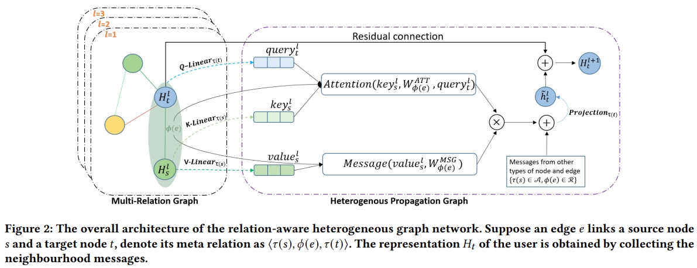

# RHGN


This is the code for the CIKM 2021 Paper: [Relation-aware Heterogeneous Graph for User Profiling](https://dl.acm.org/doi/abs/10.1145/3459637.3482170).

## Usage

Raw data and more details in [JD-Dataset](https://github.com/guyulongcs/IJCAI2019_HGAT) and [Alibaba-dataset](https://tianchi.aliyun.com/dataset/dataDetail?dataId=56)

### 1、Download processed data:
Processed data download link: [Dataset](https://drive.google.com/drive/folders/1K0tRyHOOB63PnXtFtwLU5eM2NbRTiKXG?usp=sharing)<br>
```
python tb_tmain.py --data_dir ../taobao_data/ --model RHGN --label gender --graph G_ori --gpu 3  # Alibaba-Dataset

python jd_tmain.py --data_dir ../data/ --model RHGN --graph G_ori  --label age --gpu 2  # JD-Dataset
```
### 2、Process raw data
```
python tbdata_process.py    #Alibaba-Dataset

python jddata_process.py     #JD-Dataset
```
More command can refer  **run.sh** and **baseline.sh**

## Requirements

- torch==1.6.0 <br>
- torchvision==0.7.0 <br>
- dgl==0.7.1 <br>
- scikit-learn==0.23.2 <br>
- numpy==1.19.1 <br>
- scipy ==1.5.2 <br>
- pandas==1.1.2 <br> <br>
##### Note: The code require your gpu memory not less than 20 GB. <br>

## Citation

Please cite our paper if you use the code:

```
@inproceedings{yan2021relation,
  title={Relation-aware heterogeneous graph for user profiling},
  author={Yan, Qilong and Zhang, Yufeng and Liu, Qiang and Wu, Shu and Wang, Liang},
  booktitle={Proceedings of the 30th ACM International Conference on Information \& Knowledge Management},
  pages={3573--3577},
  year={2021}
}
```

## Contact
qilongy@foxmail.com
